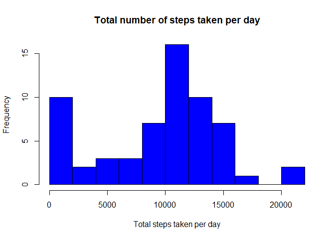
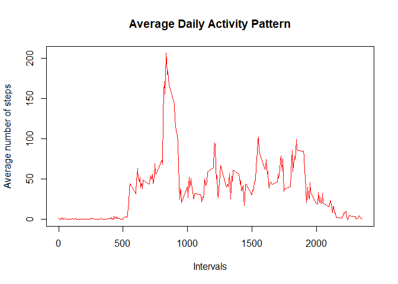
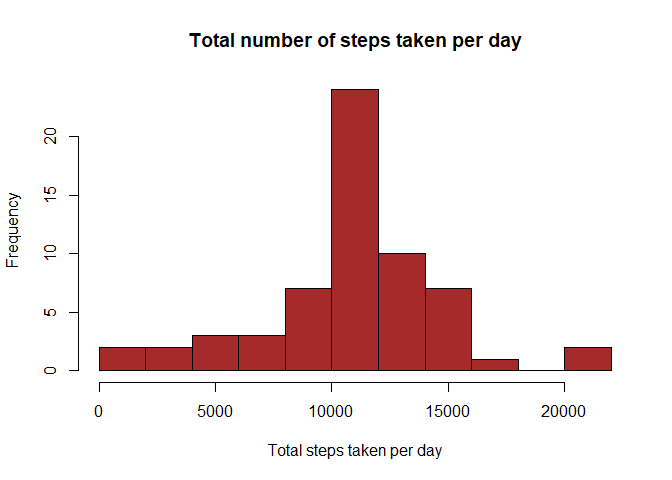
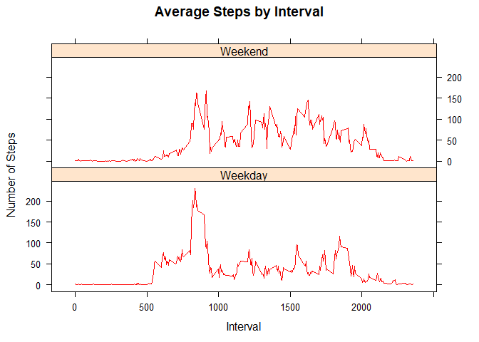

```r
knitr::opts_chunk$set(echo = TRUE, fig.path='Figs/')
```

## Loading and preprocessing the data


```r
data <- read.csv("activity.csv") 
head(data)
```

```
##   steps       date interval
## 1    NA 2012-10-01        0
## 2    NA 2012-10-01        5
## 3    NA 2012-10-01       10
## 4    NA 2012-10-01       15
## 5    NA 2012-10-01       20
## 6    NA 2012-10-01       25
```

```r
summary(data)
```

```
##      steps                date          interval     
##  Min.   :  0.00   2012-10-01:  288   Min.   :   0.0  
##  1st Qu.:  0.00   2012-10-02:  288   1st Qu.: 588.8  
##  Median :  0.00   2012-10-03:  288   Median :1177.5  
##  Mean   : 37.38   2012-10-04:  288   Mean   :1177.5  
##  3rd Qu.: 12.00   2012-10-05:  288   3rd Qu.:1766.2  
##  Max.   :806.00   2012-10-06:  288   Max.   :2355.0  
##  NA's   :2304     (Other)   :15840
```

## What is mean total number of steps taken per day? 


```r
totalstep_each_day  <- aggregate(data$steps, by=list(data$date), FUN= sum, na.rm = TRUE)
colnames(totalstep_each_day) <- c("date", "steps")
head(totalstep_each_day)
```

```
##         date steps
## 1 2012-10-01     0
## 2 2012-10-02   126
## 3 2012-10-03 11352
## 4 2012-10-04 12116
## 5 2012-10-05 13294
## 6 2012-10-06 15420
```

```r
hist(totalstep_each_day$steps, main = "Total number of steps taken per day", 
     xlab = "Total steps taken per day", col = "blue", breaks = 9 )
```

<!-- -->

### Mean and median number of steps taken each day


```r
mean_steps <- mean(totalstep_each_day$steps)
med_steps <- median(totalstep_each_day$steps)
mean_steps
```

```
## [1] 9354.23
```

```r
med_steps
```

```
## [1] 10395
```

## What is the average daily activity pattern?

### Time series plot of 5-minute interval and the average number of steps taken, averaged across all days0

```r
average_perday <- aggregate(data$steps, by= list(data$interval), FUN = mean, na.rm = TRUE)
colnames(average_perday) <- c("intervals", "average")
head(average_perday)
```

```
##   intervals   average
## 1         0 1.7169811
## 2         5 0.3396226
## 3        10 0.1320755
## 4        15 0.1509434
## 5        20 0.0754717
## 6        25 2.0943396
```

```r
plot(average_perday$intervals, average_perday$average, main = "Average Daily Activity Pattern", 
     type = "l", ylab = "Average number of steps", xlab = "Intervals", col= "red")
```

<!-- -->

### Maximum number of steps in the 5-minute interval


```r
average_perday$intervals[which.max(average_perday$average)]
```

```
## [1] 835
```

## Imputing missing values

### Total number of missing values in the dataset


```r
num_na <- nrow(data[is.na(data$steps),])
num_na
```

```
## [1] 2304
```

### Filling missing values in the dataset


```r
fill <- average_perday$average[match(data$interval, average_perday$intervals)]
head(fill)
```

```
## [1] 1.7169811 0.3396226 0.1320755 0.1509434 0.0754717 2.0943396
```

### Create a new dataset with the missing data filled


```r
new_data <- transform(data, steps= ifelse(is.na(data$steps), yes = fill, no = data$steps))
head(new_data)
```

```
##       steps       date interval
## 1 1.7169811 2012-10-01        0
## 2 0.3396226 2012-10-01        5
## 3 0.1320755 2012-10-01       10
## 4 0.1509434 2012-10-01       15
## 5 0.0754717 2012-10-01       20
## 6 2.0943396 2012-10-01       25
```

```r
summary(new_data)
```

```
##      steps                date          interval     
##  Min.   :  0.00   2012-10-01:  288   Min.   :   0.0  
##  1st Qu.:  0.00   2012-10-02:  288   1st Qu.: 588.8  
##  Median :  0.00   2012-10-03:  288   Median :1177.5  
##  Mean   : 37.38   2012-10-04:  288   Mean   :1177.5  
##  3rd Qu.: 27.00   2012-10-05:  288   3rd Qu.:1766.2  
##  Max.   :806.00   2012-10-06:  288   Max.   :2355.0  
##                   (Other)   :15840
```

### Make a new histogram of total number of steps taken each day and calculate and report the mean and median total number of steps taken per day.


```r
new_totalstep_perday  <- aggregate(new_data$steps, by=list(new_data$date), FUN= sum)
colnames(new_totalstep_perday) <- c("date", "steps")
head(new_totalstep_perday)
```

```
##         date    steps
## 1 2012-10-01 10766.19
## 2 2012-10-02   126.00
## 3 2012-10-03 11352.00
## 4 2012-10-04 12116.00
## 5 2012-10-05 13294.00
## 6 2012-10-06 15420.00
```

```r
hist(new_totalstep_perday$steps,main = "Total number of steps taken per day", 
     xlab = "Total steps taken per day", col = "brown", breaks = 9  )
```

<!-- -->

```r
new_means <- mean(new_totalstep_perday$steps)
new_meds <- median(new_totalstep_perday$steps)
new_means
```

```
## [1] 10766.19
```

```r
new_means
```

```
## [1] 10766.19
```

```r
mean_steps
```

```
## [1] 9354.23
```

```r
med_steps
```

```
## [1] 10395
```

Above we see the mean and median of total number of steps taken per day in the new dataset. They differ from the mean and median of total number of steps taken per day in the old data set because we change missing values with the mean for that 5-minute interval.

## Are there differences in activity patterns between weekdays and weekends?


```r
new_data$date <- as.POSIXct(new_data$date, format = "%Y-%m-%d")
days <- weekdays(new_data$date)
for (i in 1:length(days))
{
    if(days[i] == "Sunday" || days[i] == "Saturday")
      {days[i] = "Weekend"}
    else
    {days[i] = "Weekday"}
}
new_data$days <- as.factor(days)
summary(new_data)
```

```
##      steps             date                        interval     
##  Min.   :  0.00   Min.   :2012-10-01 00:00:00   Min.   :   0.0  
##  1st Qu.:  0.00   1st Qu.:2012-10-16 00:00:00   1st Qu.: 588.8  
##  Median :  0.00   Median :2012-10-31 00:00:00   Median :1177.5  
##  Mean   : 37.38   Mean   :2012-10-31 00:25:34   Mean   :1177.5  
##  3rd Qu.: 27.00   3rd Qu.:2012-11-15 00:00:00   3rd Qu.:1766.2  
##  Max.   :806.00   Max.   :2012-11-30 00:00:00   Max.   :2355.0  
##       days      
##  Weekday:12960  
##  Weekend: 4608  
##                 
##                 
##                 
## 
```

### Time series plot: 5-minute interval and the average number of steps taken, averaged across all  weekend days


```r
week_av <- aggregate(new_data$steps ~ new_data$interval + new_data$days,  FUN = mean)
head(week_av)
```

```
##   new_data$interval new_data$days new_data$steps
## 1                 0       Weekday     2.25115304
## 2                 5       Weekday     0.44528302
## 3                10       Weekday     0.17316562
## 4                15       Weekday     0.19790356
## 5                20       Weekday     0.09895178
## 6                25       Weekday     1.59035639
```

```r
library(lattice)
xyplot(week_av$`new_data$steps` ~
week_av$`new_data$interval`|week_av$`new_data$days`, main="Average Steps by Interval",xlab="Interval", ylab="Number of Steps",layout=c(1,2), type="l", col= "red")
```

<!-- -->


